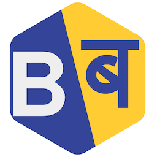

[The Barabari Project](https://plutoniumm.github.io/BarabariProject/)

<!-- i18n: https://github.com/kaisermann/svelte-i18n/blob/HEAD/docs/Getting%20Started.md -->

# Todo
- Use IntersectionObserver in `/lib` as `use:enterViewport` & `use:exitViewport`
- Use markdown to allow team page content (`marked` has been added)
- Absent Hindi Lang
- Forms array not centered
- Forms button not linked

- i18n
- - https://www.npmjs.com/package/svelte-i18next
- - https://github.com/NishuGoel/svelte-i18next/tree/main/example
